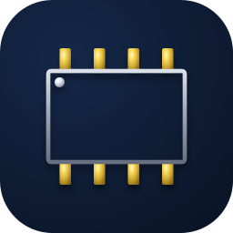
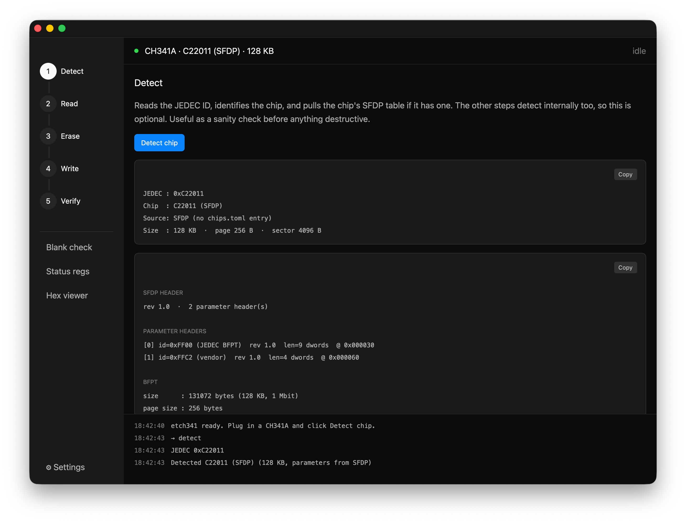

<p align="center">
  
</p>

# etch341

[](https://github.com/packetThrower/etch341/actions/workflows/ci.yml)
[](https://github.com/packetThrower/etch341/releases/latest)
[](https://github.com/packetThrower/etch341/releases)
[](Cargo.toml)
[](LICENSE)

<p align="center">
  
</p>

## Minimum OS versions

**macOS** (Apple Silicon and Intel)

[](#install)
[](#install)
[](#install)

**Windows** (x64 and ARM64)

[](#windows)
[](#windows)

**Linux** (amd64 and arm64)

[](#linux)
[](#linux)
[](#linux)
[](#linux)
[](#linux)

The GUI uses the GPUI rendering stack, which on Linux requires a
Vulkan-capable GPU with current Mesa drivers. The headless CLI
(`cargo install --no-default-features` or `etch341 <subcommand>` on
the released binary) has no graphics requirements.

Cross-platform CLI + GUI flash programmer for the **CH341A** USB SPI/I²C
interface. Userspace USB on Linux + macOS (no driver to install).
Windows uses the built-in **WinUSB** kernel driver, but it needs a
one-time Zadig bind to the CH341A — see [Install → Windows](#windows).

## Status

Working programmer for SPI NOR up to 32 MB+, on both 3.3V and 1.8V chips
(with a CH341A V1.7+ module for the 1.8V parts). Chips ≤ 16 MB use
standard 3-byte addressing; > 16 MB chips use the 4-byte opcode variants
(0x13 / 0x12 / 0x21 / 0xDC) automatically based on the chip's size. Round-trip validated
against a real Macronix MX25U4033E on an NVIDIA GTX 1060 — full
erase → blank-check → write → verify cycle landed byte-identical (SHA-256
match) to the original VBIOS.

| Feature | CLI | GUI |
| --- | --- | --- |
| Detect (JEDEC ID → chip lookup) | ✅ | ✅ |
| Read | ✅ | ✅ |
| Erase (full + range) | ✅ | ✅ (arm/confirm) |
| Write (with erase + verify) | ✅ | ✅ (arm/confirm + file picker) |
| Verify | ✅ | ✅ (file picker) |
| Blank check | ✅ | ✅ |
| Status registers (SR1/2/3 decode) | ✅ (`sr`) | ✅ |
| SFDP parameter table | ✅ (`sfdp`) | ✅ (Detect pane) |
| Security registers / OTP (read / erase / write) | ✅ (`otp`) | ✅ (arm/confirm) |
| Settings (clock, accent, updates, …) | ✅ (`--speed`) | ✅ |
| 4-byte addressing (>16 MB chips) | ✅ | ✅ |
| I²C scan / read / write / verify / blank-check / erase | ⚠️ \* | — |

> \* **Scan + read are silicon-validated** against a real 24C02
> (the probe ACK-bit polarity assumption held — the chip ACKed at
> `0x50` and round-tripped a 256-byte read). The **write / erase
> path is still owed a clean-chip validation**: the first attempt
> bricked a part by clocking it past spec, which is why I²C now
> defaults to 100 kHz and refuses anything above 400 kHz. Reports
> from a healthy chip welcome via GitHub Issues.

66 unit tests covering the SPI / I²C protocols (including the SFDP
parser and the OTP / security-register ops), the high-level ops,
and the inspect/search primitives, all running against mock transports
or pure inputs. Hardware-touching tests are gated behind
`--features hardware`.

### Hardware-validated

- **Macronix MX25U4033E** (1.8V, 4 Mbit) on a GTX 1060 VBIOS chip
  (GP106 PG410). Full erase → write → verify cycle returns the chip
  to a byte-identical state (matching SHA-256 across pre- and
  post-cycle reads).
- **CH341A V1.7** mini programmer with on-board ZIF socket + SOIC-8
  clip. The V1.7 has a 1.8V mode that older V1.3 boards lack — required
  for the U-series Macronix chips and most modern GPU VBIOS.

Other chips in `chips/chips.toml` are entered from datasheets but
haven't been individually exercised against silicon. If you run a
JEDEC `detect` on a chip and the response decodes correctly to a
named entry, the rest of the operations are very likely to work
(they're chip-agnostic at the protocol level).

### Partially hardware-validated

- **I²C / 24Cxx EEPROMs.** Confirmed end-to-end against a real
  **AT24C02**: `read` / `write` / `erase` / `verify` / `blank-check`
  all round-trip byte-exact, at both 100 kHz and 20 kHz. Getting
  there shook out two real bugs (writes always timed out polling an
  ACK the CH341 never exposes; multi-byte reads weren't NACK-
  terminated and corrupted past ~30 bytes) — both fixed. Still
  **mock-only**, pending silicon: the 2-byte-address parts (24C32 and
  up) and the bit-stuffed 24C04 / 08 / 16 sub-families. `scan` can't
  see a *blank* EEPROM — the CH341 doesn't expose the ACK bit, so an
  all-`0xFF` chip is indistinguishable from an empty bus; address it
  directly with `--chip`.

## Install

### Prerequisites

- Rust 1.85+ (uses 2024 edition)
- A C compiler (cc / clang) — `rusb` builds libusb-1.0 from source
  and links it statically into the binary, so there's no
  system-wide libusb install needed at build or runtime
- A CH341A USB programmer (the common "black module" or the "V1.3 mini" with
  on-board ZIF socket both work)

If you'd rather grab a pre-built artifact instead of compiling, head
to the [Releases page](https://github.com/packetThrower/etch341/releases) —
each release ships native installers for arm64 + amd64 on all three
platforms:

| Platform | Installer / Package | Also |
|---|---|---|
| macOS | `etch341-<ver>-<arch>-macos.dmg` (drag-to-install) | `etch341-macOS-<arch>-<ver>.zip` (bare `.app` bundle) |
| Windows | `etch341-<ver>-<arch>-windows-setup.exe` (NSIS) | `etch341-<ver>-<arch>-windows.msi` (MSI, stable tags only) |
| Windows | — | `etch341-<ver>-<arch>-windows.zip` (portable bare `.exe`) |
| Linux (Debian/Ubuntu) | `etch341-<ver>-<arch>-linux.deb` | — |
| Linux (Fedora/openSUSE/RHEL) | `etch341-<ver>-1.<rpm-arch>.rpm` | — |
| Linux (Arch) | `etch341-<ver>-1-<rpm-arch>.pkg.tar.zst` | — |
| Linux (any) | `etch341-<ver>-<arch>-linux.AppImage` (universal) | — |

That's 19 artifacts per release (6 macOS + 6 Windows + 8 Linux,
plus a `SHA256SUMS` line for everything). The Linux `.deb` /
`.rpm` / `.pkg.tar.zst` installs drop the udev rule into
`/usr/lib/udev/rules.d/` automatically; the AppImage and bare
binaries don't (run the manual `sudo cp` step from the Linux
section below the first time).

### macOS

The easiest path is the Homebrew tap, which always tracks the
latest stable release and auto-updates with `brew upgrade`:

```sh
brew install packetThrower/tap/etch341
```

Or build from source:

```sh
cargo install --path .
```

No driver setup needed — macOS leaves the CH341A's vendor interface
alone, and libusb is bundled into the binary.

### Linux

```sh
sudo cp platform/udev/99-ch341a.rules /etc/udev/rules.d/
sudo udevadm control --reload
cargo install --path .
```

The udev rule lets unprivileged users open the device. Without it you'll
hit `PermissionDenied`.

### Windows

Windows doesn't ship a generic userspace USB driver, so the CH341A
either enumerates as an unknown device or gets claimed by a vendor
serial-port driver — either way, libusb can't open it. The one-time
fix is to bind the **WinUSB** generic driver to the device:

1. Plug in the CH341A.
2. Run [Zadig](https://zadig.akeo.ie/) (≈600 KB, no installer).
3. In Zadig's `Options` menu, enable `List All Devices`.
4. Select the entry with VID `0x1A86` / PID `0x5512`, choose **WinUSB**
   from the driver dropdown, and click `Install Driver`.
5. Install etch341 from the Scoop bucket (auto-updates via `scoop update`):

   ```powershell
   scoop bucket add packetThrower https://github.com/packetThrower/scoop-bucket
   scoop install etch341
   ```

   Or build from source: `cargo install --path .`.

You only need to do steps 1–4 once per machine. If `etch341 detect`
reports `DeviceNotFound` on Windows after running it once, the driver
binding is usually the cause — re-check in Zadig that the device is
still bound to WinUSB and not to a vendor driver that took over after
an update.

## Usage

### CLI

```sh
etch341 detect                       # identify the chip
etch341 read -o bios.bin             # dump entire chip to file
etch341 read -o -                    # dump to stdout (pipe to anything)
etch341 read -o - | sha256sum        # hash a chip without a temp file
etch341 read -o head.bin --length 0x1000   # first 4 KB only
etch341 write -i bios.bin            # erase + program + verify
etch341 write -i bios.bin --no-erase --no-verify   # raw program
etch341 erase                        # full chip erase
etch341 erase --range 0x10000:0x10000   # erase one 64 KB block
etch341 verify -i bios.bin           # compare without writing
etch341 blank-check                  # confirm all 0xFF
etch341 sr                           # dump SR1/SR2/SR3 with decoded bits
etch341 sfdp                         # decode the chip's SFDP table
etch341 otp read                     # dump the security / OTP registers
```

I²C EEPROMs (24Cxx family) use the nested `i2c` subcommand.

> ⚠️ **The I²C path hasn't been hardware-validated yet.** Code,
> protocol, and tests are all in place but nobody's run it against
> a real 24Cxx chip. Your first run is also our bring-up. If `i2c
> scan` returns either an empty list or every address (rather than
> just the chip's address(es)), the most likely culprit is the
> CH341A ACK-bit polarity assumption in `src/ch341.rs::i2c_probe` —
> open an issue with the verbose-mode (`-v i2c scan`) output and
> we'll get it sorted.

Unlike SPI NOR there's no JEDEC ID register, so the chip must be
selected explicitly with `-c`:

```sh
etch341 i2c scan                            # list 7-bit addrs that ACK
etch341 -c 24C256 i2c read -o eeprom.bin    # dump entire chip
etch341 -c 24C256 i2c write -i eeprom.bin   # program + verify
etch341 -c 24C256 i2c verify -i eeprom.bin  # compare without writing
etch341 -c 24C02 i2c blank-check            # confirm all 0xFF
etch341 -c 24C02 i2c erase                  # write 0xFF to every byte
```

`--straps <0..7>` selects the A0/A1/A2 pin value if the chip is wired
non-default. The 24C04/08/16 use bit-stuffing in the slave address
for their high memory bits; this is handled automatically.

Supported families: 24C01 / 02 / 04 / 08 / 16 / 32 / 64 / 128 / 256 /
512. Other 24Cxx chips work if you add an entry to `chips/i2c_chips.toml`.

The CLI also has three offline inspection commands that work on flash
dump files (no hardware required):

```sh
etch341 chips                            # list every supported chip
etch341 chips --find mx25                # substring filter on name or JEDEC
etch341 chips --bus i2c                  # filter to one bus family

etch341 strings -i dump.bin              # printable ASCII strings ≥4 chars
etch341 strings -i dump.bin --min-len 8  # noisier-but-richer threshold

etch341 search "55 AA" -i dump.bin       # find hex pattern (spaces optional)
etch341 search "Award" -i dump.bin       # ASCII (case-insensitive)
etch341 search "DEADBEEF" -i dump.bin --context 32   # widen the gutter
```

`search` parses the pattern as hex when the condensed form is even-length
and all hex digits (`55AA`, `DE AD BE EF`); anything else is taken as
ASCII. Matched bytes print in upper-case hex; surrounding context stays
lower-case for an at-a-glance visual contrast.

Global flags:

- `-v, --verbose` — log every SPI or I²C transaction to stderr.
  Invaluable for debugging in-circuit issues and for spotting wiring
  problems (every `-> OUT` line should be followed by a sensible
  `<- IN`; missing IN bytes mean either the chip isn't responding or
  the bus is mis-wired).
- `-c, --chip <NAME>` — for SPI, overrides JEDEC autodetect with a
  chip name from `chips/chips.toml` (e.g. `W25Q128JV`). For I²C and
  for `--dry-run` it's **required** (there's no JEDEC equivalent on
  I²C, and dry-run has no hardware to autodetect).
- `-s, --speed <KHZ>` — bus clock speed. Supported rates on the
  CH341A: 20, 100, 400, 750. SPI defaults to 750; **I²C defaults to
  100 and rejects anything above 400** (the 24Cxx family is spec'd
  at 400 kHz max — over-clocking one bricked a part during bring-up).
- `-n, --dry-run` — for hardware-touching commands, validate
  everything possible (chip name in DB, input file is readable,
  start + length fits the chip) and print a `[dry-run]` summary of
  what would happen. Never opens the CH341. Useful for sanity-
  checking flags before you actually pull the trigger on an erase or
  write. Offline commands (`chips`, `strings`, `search`) ignore the
  flag because they don't touch hardware anyway.

### GUI

```sh
etch341      # no subcommand → opens the GUI window
```

Build the CLI-only variant (no GPUI fetch, much smaller binary, faster
build) with:

```sh
cargo build --release --no-default-features
```

## Hardware notes

### In-circuit programming on enterprise hardware

In-circuit attempts on **server-class boards, dual-BIOS systems, and
firewalls** frequently fail. The host's SPI controller actively drives MISO
low even when the board is "powered off" — `etch341 detect` returns
`JEDEC ID : 0x000000` and the verbose log shows clean command bytes going
out but nothing meaningful coming back.

Diagnose with the loopback test:

```sh
etch341 detect -v       # with clip OFF the chip; nothing else changed
```

- `<- IN [4]: ffffffff` → CH341A is healthy; the target board is fighting us
- `<- IN [4]: 00000000` → CH341A or wiring problem, not the target

Remedies, in order of effort:

1. Use a loose chip in the CH341A's on-board ZIF socket
2. Lift pin 8 (VCC) of the in-circuit chip and inject 3.3V externally
3. Hot-air the chip off and use the ZIF

### Voltage

The black-module CH341A has a 3.3V/5V jumper near the USB end. **3.3V
is correct for every 3.3V family in `chips/chips.toml`** (W25Q, W25X,
MX25L, GD25Q, SST25VF, AT25SF, EN25QH, P25Q, IS25LP). The 1.8V
families (W25Q*JW, MX25U, GD25LQ) need a 1.8V-capable programmer —
either the V1.7 module's separate 1.8V switch or a level-shifter
adapter; running them at 3.3V will damage them. **5V will damage
every chip in the DB** — don't flip the jumper to 5V unless you
know exactly why.

### Pin 1

The SOIC-8 clip's red wire = pin 1. The chip's pin 1 is marked with a dot
or notch on the package. About half of first-attempt failures are
clip-reversed.

## Architecture

```
src/
├── main.rs       entry point; no-args → GUI, subcommand → CLI
├── cli.rs        clap derive definitions + dispatch
├── error.rs      thiserror enum
├── ch341.rs      USB layer; impls both SpiTransport and I2cTransport
├── spi.rs        SPI NOR opcodes + SpiTransport trait + helpers
├── ops.rs        high-level SPI read / erase / write / verify / blank / detect
├── i2c.rs        24Cxx protocol + I2cTransport trait + helpers
├── i2c_ops.rs    high-level I²C scan / read / write / verify / blank / erase
├── chipdb.rs     TOML chip DB loader (SPI + I²C, embedded at build)
├── inspect.rs    parse-pattern / extract-strings / find-pattern shared by CLI + GUI
├── prefs.rs      ~/.config/etch341/prefs.toml load/save (GUI settings)
└── gui/          GPUI frontend; behind the `gui` cargo feature (default-on)

chips/chips.toml      70 SPI NOR entries across Winbond (W25X, W25Q,
                      W25Q*JW 1.8V), Macronix (MX25L, MX25U 1.8V),
                      GigaDevice (GD25Q, GD25LQ 1.8V), SST25VF,
                      Adesto AT25 (SF/DF/SL 1.8V/DN), EON EN25QH,
                      PUYA P25Q, ISSI IS25LP
chips/i2c_chips.toml  10 I²C EEPROM entries (24C01 .. 24C512)
```

The `SpiTransport` trait abstracts the USB layer so the high-level ops can
be unit-tested against a deterministic mock (`src/spi.rs::test_support::MockSpi`).
The `Ch341` struct is the production implementation.

## Development

```sh
just build        # full build (CLI + GUI; first time pulls the gpui git dep)
just build-cli    # CLI only, much faster
just test         # unit tests, no hardware
just run -- detect -v
```

Or use Cargo directly:

```sh
cargo build --no-default-features    # CLI only
cargo test  --no-default-features
cargo run                            # GUI
cargo run   --no-default-features -- detect -v
```

The app icon is `build/appicon.svg` (a top-down wireframe of a
SOIC-8 in the family palette of Baudrun + PortFinder). The other
icon files in `build/` and `resources/icons/` are generated from
it by `build/make-icon.sh` — re-run that script after editing the
SVG (requires `rsvg-convert`, ImageMagick's `magick`, and
`iconutil` for the macOS `.icns`).

## License

GPL-3.0-or-later. See [LICENSE](LICENSE) for the full text.
